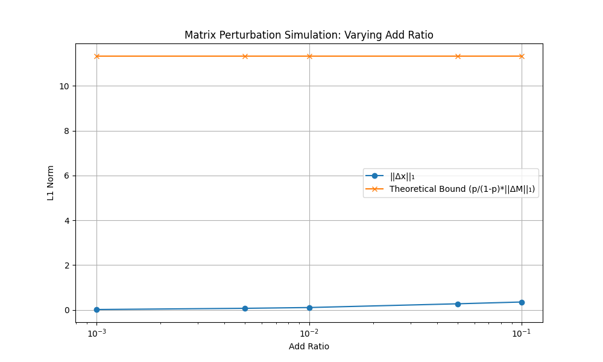

# Progress records for incremental PageRank project

<center>Haopeng Zhang</center>

<center>Using dataset: [wiki-Vote from stanford](https://snap.stanford.edu/data/wiki-Vote.html).</center>

<center>A python implementation of incremental PageRank Algorithm</center>

## Step 1: Theoretical Understanding of PageRank

### PageRank

#### *Background*

1998 年，斯坦福大学的博士生 Larry Page 和 Sergey Brin 创立了 Google 公司，其核心技术是通过 PageRank 技术对海量数据进行分析，利用网页相互连接的关系对网页进行组织，确定出每个网页的重要级别（PageRank）。当用户检索时，Google 找到符合要求的网页并按照他们的重要级别排序并以此向用户列出，这使得用户可以在前几条检索结果就找到需要的结果。对重要级别的直观理解是：如果网页 A 中存在一条链接指向网页 B，就认为网页 A 给网页 B 投了一票。因此，被链接的网页的重要级别与链接它的网页的重要级别相关，换句话说，如果网页 A 的重要级别是高的，那么网页 B 的重要级别也相应的是高的。

PageRank 成为了高效搜索的主要手段。在互联网的广泛使用下，PageRank 保证人们在生产、生活中获取信息的效率，并且在网络信息量日渐增长的时代中发挥着不可或缺的作用。

#### *Mathematical Modeling*

对于有 $n$ 个网页的网络，定义 $n\times n$ 的邻接矩阵 $G=(g_{ij})\in\mathbb{R}^{n\times n}$，若网页 $j$ 有一个链接到网页 $i$，则 $g_{ij}=1$，否则 $g_{ij}=0$。$c_j = \sum_{i=1}^{n}g_{ij}$ 称为网页 $j$ 的出度，即从网页 $j$ 出发的链接的总数，类似的 $r_i=\sum_{j=1}^{n}g_{ij}$ 称为网页 $i$ 的入度，即指向网页 $i$ 的链接总数。

假设一个随机的网上冲浪过程，即每次看完当前网页后，有两种选择：

1. 在当前网页的链接中随机挑选一个，假设进行这一动作的概率是 $p$。
2. 随机新开一个网页。

这在数学上是一个马尔可夫过程，且这样得随机冲浪过程一直进行下去，某一个网页被访问到的概率就是它的 PageRank。那么如果当前网页是 $j$，下一次访问到网页 $i$ 的概率的计算方式就是：

1. 若网页 $j$ 存在一个链接指向网页 $i$，
   1. 通过网页 $j$ 上的链接访问网页 $i$ 的概率就是 $p\times \frac{1}{c_j}$。
   2. 通过随机新开一个网页，打开的恰好是网页 $i$ 的概率就是 $(1-p)\times\frac{1}{n}$。
   3. 访问到网页 $i$ 的概率是 $p\times \frac{1}{c_i}+(1-p)\times\frac{1}{n}$。
2. 若网页 $i$ 不在网页 $j$ 的连接上，通过随机新开一个网页打开网页 $i$ 的概率就是 $(1-p)\times\frac{1}{n}$。

由于 $g_{ij}$ 为 1 或 0，表示网页 $j$ 上是否存在一个链接指向网页 $i$，下一次访问到网页 $i$ 的概率可以表示为：

```math
a_{ij}=g_{ij}\times[p\times\frac{1}{c_j}+(1-p)\times\frac{1}{n}]+(1-g_{ij})\times[(1-p)\times\frac{1}{n}]=\frac{pg_{ij}}{c_j}+\frac{1-p}{n}
```

任意两个网页间的转移概率构成一个转移矩阵 $A=(a_{ij})$。设 $n$ 阶对角矩阵 $D=(d_{ij})$ 为各个网页出度的倒数（若 $c_j=0$，意味着 $g_{ij}=0$，$d_{jj}$ 可设为 1），$\vec{e}\in\mathbb{R}^{n}$ 为元素全为 1 的 $n$ 维列向量，向量 $\vec{f}$ 满足：

```math
f_j=\begin{cases}
\frac{1-p}{n},\quad c_j\neq 0\\
\frac{1}{n},\quad c_j=0
\end{cases}
```

在这里，$\vec{f}$ 并不是一个完全相同的常数向量，而是专门为了解决悬挂节点而设计的。悬挂节点指的是没有出链的网页（即 $c_j=0$）。如果直接按比例计算，这部分网页会导致系统中的概率总和不断流失。因此，当遇到悬挂节点（$c_j=0$）时，我们将其下一步访问任何网页的概率强行设为 $\frac{1}{n}$，相当于强制进行一次随机跳转，以此补偿跳转概率，确保整个网络的转移概率守恒。

那么转移矩阵 $A$ 可以表示为以下形式：

```math
A=pGD+\vec e\vec f^T
```

设 $\vec x^{(k)}$ 是 $k$ 时刻访问各个网页的概率分布（$\sum_{i} x^{(k)}_i=1$），那么下一时刻浏览各个网页的概率分布就是 $\vec x^{(k+1)}=A\vec x^{(k)}$。当这个过程无限进行下去，达到极限情况，即网页访问概率收敛到一个极限值，这个极限向量 $\vec x$ 就是各个网页的 PageRank，它满足 $A\vec x=\vec x$，且 $\sum_{i}x_i=1$。

#### *Power Method*

幂法是求解大规模系数矩阵的主特征向量的可靠、唯一的选择。

#### *Theoretical Bound of Network Perturbation*

PageRank 向量 $\vec x$ 满足 $\sum_{i}^n x_i=1$（即 $\vec{e}^T\vec{x}=1$），且 $A\vec x=\vec x$。

对于包含悬挂节点（即出度 $c_j=0$ 的节点）的网络，$GD$ 必然存在全 0 列，因此直接将其视作列和为 1 的列随机矩阵是相互矛盾的。为了严谨地进行推导，我们需要引入悬挂节点指示向量 $\vec{d}$，当节点 $j$ 为悬挂节点时 $d_j=1$，否则 $d_j=0$。

由于 $\vec{f}^T$ 的第 $j$ 个分量可以写为 $f_j = \frac{1-p}{n} + \frac{p}{n}d_j$，转移矩阵 $A$ 可重写为：

```math
A = pGD + \vec{e}\left(\frac{1-p}{n}\vec{e}^T + \frac{p}{n}\vec{d}^T\right) = p\left(GD + \frac{1}{n}\vec{e}\vec{d}^T\right) + \frac{1-p}{n}\vec{e}\vec{e}^T
```

定义 $\bar{M} = GD + \frac{1}{n}\vec{e}\vec{d}^T$，由于 $\frac{1}{n}\vec{e}\vec{d}^T$ 正好补齐了悬挂节点缺失的概率，此时 $\bar{M}$ 是列和为 1 的列随机矩阵。

于是，PageRank 的特征方程可以改写为：

```math
\vec{x} = A\vec{x} = p\bar{M}\vec{x} + \frac{1-p}{n}\vec{e}(\vec{e}^T\vec{x})
```

因为 $\vec{e}^T\vec{x}=1$，令 $\vec{v}=\frac{1}{n}\vec{e}$（均匀分布向量），上式简化为：

```math
\vec x=p\bar{M}\vec x+(1-p)\vec v
```

进一步将 $\vec x$ 表达为线性系统 $\vec x=(1-p)(I-p\bar{M})^{-1}\vec v$。而 $I-p\bar{M}$ 之所以可逆，是因为对于列随机矩阵 $\bar{M}$ 有 $|\lambda(\bar{M})|\le\rho(\bar{M})=1$，进而 $I-p\bar{M}$ 的特征值均不为 0。记 $A_0=I-p\bar{M}$，则 PageRank 向量 $\vec x=(1-p)A_0^{-1}\vec v$。这一形式将 $\vec x$ 表示为线性系统，并且 $\vec v$ 是均匀分布，网络结构的扰动仅导致 $A_0$ 的变化，便于后续对 PageRank 向量受矩阵扰动影响的探究。

引入扰动 $\bar{M}\rightarrow \bar{M}+\Delta \bar{M}$ 导致 PageRank 向量变化：$\vec x\rightarrow \vec x+\Delta\vec x$。$A_0$ 相应变为 $A_0-p\Delta \bar{M}$，有 $\vec x+\Delta\vec x=(1-p)(A_0-p\Delta \bar{M})^{-1}\vec v$。对 $(A_0-p\Delta \bar{M})^{-1}$ 进行近似一阶展开 $(A+E)^{-1}\approx A^{-1}-A^{-1}EA^{-1}$ 得到 $(A_0-p\Delta \bar{M})^{-1}\approx A_0^{-1}+pA_0^{-1}\Delta \bar{M}A_0^{-1}$。进一步推导：

```math
\begin{align}
\Delta\vec x&=(1-p)(A_0^{-1}+pA_0^{-1}\Delta \bar{M}A_0^{-1}-A_0^{-1})\vec v\\
&=(1-p)pA_0^{-1}\Delta \bar{M}A_0^{-1}\vec v\\
&=pA_0^{-1}\Delta \bar{M}\vec x
\end{align}
```

取 l~1~ 范数，有

```math
\begin{align}
||\Delta \vec x||_1&=||pA_0^{-1}\Delta \bar{M}\vec x||_1\\
&\le p||A_0^{-1}||_1||\Delta \bar{M}||_1||\vec x||_1\\
&=p||A_0^{-1}||_1||\Delta \bar{M}||_1\\
&=p||\Delta \bar{M}||_1||\sum_{k=0}^{\infin}(p\bar{M})^k||_1\\
&\le p||\Delta \bar{M}||_1\sum_{k=0}^{\infin}p^k||\bar{M}^k||_1\\
&\le p||\Delta \bar{M}||_1\sum_{k=0}^{\infin}p^k||\bar{M}||^k_1\\
&=p||\Delta \bar{M}||_1\sum_{k=0}^{\infin}p^k\\
&=\frac{p}{1-p}||\Delta \bar{M}||_1
\end{align}
```

综上，当真正的列随机转移矩阵发生扰动 $\Delta \bar{M}$ 时，PageRank 向量的变化有如下界限：

```math
\|\Delta \vec{x}\|_1 \leq \frac{p}{1-p} \|\Delta \bar{M}\|_1
```

---

## Step 2: Environment Setup and Implementation of Static PageRank

用这些命令来配置环境：

```bash
conda create -n na_pr_env python=3.10
conda activate na_pr_env
pip install -r requirements.txt
```

静态 PageRank 算法的实现：

- `note.ipynb`

  - `load_data` 从指定文件（Wiki-Vote.txt 相同格式）加载数据。
  - `build_adjacency_matrix` 用 `edges`, `n_nodes`, `p` 来计算 $A$。
  - `build_components` 用 `edges`, `n_nodes`, `p` 来计算 $G$（CSR 格式）、$D$（一维数组）、$\vec f$。
  - `power_method_A` 用 `A`，`n_nodes`, `max_iter`, `tol` 对 $A$ 进行幂法得到 PageRank 向量。
  - `power_method_components` 用 `G`，`D`，`e`，`f`，`n_nodes`，`p`，`max_iter`, `tol` 不保存 $A$，直接对 $pGD+\vec{e}\vec{f^T}$ 进行幂法来得到 PageRank 向量。

- `static_textbook_implementation_power_method.py`

  - 一个静态 PageRank 的幂法实现，在中小规模图上验证了其正确性。

  - 完全仿照教材中对 PgeRank 的算法介绍，从原始数据开始一步步提取计算 $G$，$D$，$\vec f$，最终得到矩阵 $A$。在此之后对 $A$ 进行幂法，得到其主特征值，也就是各网页的 PageRank 向量。

  - 然而当面对大规模数据时，直接计算并全量保存矩阵 $A=pGD+\vec{e}\vec{f^{T}}$ 无疑是对时间、空间和算力的浪费，因此需要用 CSR 格式实现稀疏矩阵的存储和计算，并在更大规模的图上测试性能和正确性。

  - 在 Wiki-Vote 的 7115 个节点 + 103689 条有向边的网络拓扑下进行测试，全量保存矩阵 $A$ 的计算过程所花费的时间要远远超过用 CSR 格式实现的稀疏矩阵的存储和计算，两种方法的具体表现和差异如下：

    ```bash
    python src/scripts/static_textook_implementation_power_method.py --data_file_path ./data/Wiki-Vote.txt
    
    ============================================================
                    PAGERANK COMPUTATION REPORT                 
    ============================================================
    [*] Data Source  : ./data/Wiki-Vote.txt
    [*] Nodes        : 7115
    [*] Edges        : 103689
    [*] Parameters   : p=0.85, tol=1e-06
    ------------------------------------------------------------
    
    [1] Running: Basic Implementation (Dense Matrix)...
        Done! Time: 2.6537s
    
    [2] Running: Component-wise Implementation (CSR Sparse)...
        Done! Time: 0.0164s
    
    ############################################################
      METHOD: Basic (Dense)
      Execution Time: 2.6537 seconds
    ############################################################
    
      Top 5 Ranking:
      -----------------------------------
      Rank     | Node ID    | Score     
      -----------------------------------
      1        | 327        | 0.004607
      2        | 410        | 0.003680
      3        | 1333       | 0.003587
      4        | 712        | 0.003284
      5        | 906        | 0.002609
      -----------------------------------
    
      Vector Preview:[0.0002, 0.0008, 0.0018, 0.0022 ... 0.0001, 0.0001, 0.0001, 0.0001]
    
    
    ############################################################
      METHOD: Component-wise (CSR)
      Execution Time: 0.0164 seconds
    ############################################################
    
      Top 5 Ranking:
      -----------------------------------
      Rank     | Node ID    | Score     
      -----------------------------------
      1        | 327        | 0.004607
      2        | 410        | 0.003680
      3        | 1333       | 0.003587
      4        | 712        | 0.003284
      5        | 906        | 0.002609
      -----------------------------------
    
      Vector Preview:[0.0002, 0.0008, 0.0018, 0.0022 ... 0.0001, 0.0001, 0.0001, 0.0001]
    
    ============================================================
                           END OF REPORT                        
    ============================================================
    ```

---

## Step3: Incremental PageRank Algorithm

#### *Warm-Start PageRank*

当网络结构发生扰动的时候，教材中提到了一种能够相较于随机化初始向量并重新执行幂法更快的方法是，使用扰动前得到的 PageRank 向量作为扰动后幂法的初始值，实验证明在 Wiki-Vote 数据集上，增添和删除边的比例在 0.1% 的情况下，Warm-Start 方法达到收敛所需要的迭代次数和迭代时间，较随机初始化向量进行幂法迭代均有下降，且迭代结果差异极小，可忽略不计。

```bash
python src/scripts/warm_start.py

============================================================
           WARM-START INCREMENTAL PAGERANK REPORT           
============================================================
[*] Loading original graph and calcutaing PageRank vector...
[*] Perturbating (adding and droping edges)...
------------------------------------------------------------
[1] Cold Start (Initializing with a random vector)...
    Done! Iterations: 27, Time: 0.004687s

[2] Warm-Start (Initialize with the previous PageRank vector)...
    Done! Iterations: 23, Time: 0.004432s

############################################################
  METHOD: Cold Start
  Execution Time: 0.004687 seconds
  Iterations    : 27
############################################################

  Top 5 Ranking:
  -----------------------------------
  Rank     | Node ID    | Score     
  -----------------------------------
  1        | 327        | 0.004569
  2        | 712        | 0.003897
  3        | 657        | 0.003718
  4        | 410        | 0.003590
  5        | 1333       | 0.003443
  -----------------------------------

  Vector Preview:
  [0.0002, 0.0008, 0.0017, 0.0021 ... 0.0000, 0.0000, 0.0000, 0.0000]


############################################################
  METHOD: Warm-Start
  Execution Time: 0.004432 seconds
  Iterations    : 23
############################################################

  Top 5 Ranking:
  -----------------------------------
  Rank     | Node ID    | Score     
  -----------------------------------
  1        | 327        | 0.004569
  2        | 712        | 0.003897
  3        | 657        | 0.003718
  4        | 410        | 0.003590
  5        | 1333       | 0.003443
  -----------------------------------

  Vector Preview:
  [0.0002, 0.0008, 0.0017, 0.0021 ... 0.0000, 0.0000, 0.0000, 0.0000]

============================================================
[3] Consistency & Performance Check:
    ||x_cold - x_warm||_1 = 2.6707e-09 (should be close to 0)
------------------------------------------------------------
Conclusion:
 -> Iteration number reduced: 4 (14.81%)
 -> Running time reduced    : 0.000256s (5.45%)
============================================================
                       END OF REPORT                        
============================================================
```

> [!NOte]
>
> 为啥warm-start是管用的呢？

#### *Residual Push PageRank*

一种增量式算法。

```bash
python src/scripts/local_push.py

============================================================
           INCREMENTAL PAGERANK SCALABILITY TEST            
============================================================
[*] 1/3 Calculating original converged PageRank vector...
[*] 2/3 Simulating network topology changes...
    -> Original Edges : 103689
    -> Added Edges    : 10 (0.01%)
    -> Dropped Edges  : 10 (0.01%)
    -> New Total Edges: 103689

[*] 3/3 Running PageRank Updates...

[1] Cold Restart (Scratch)
    -> Iters: 026 | Time: 0.004044s

[2] Warm-Start (Old x as Init)
    -> Iters: 016 | Time: 0.002506s

[3] Residual Push
    -> Iters: 015 | Time: 0.002183s

============================================================
[*] Check ||Cold - Warm||_1: 1.2144e-09
[*] Check ||Cold - Vec||_1 : 1.2144e-09
------------------------------------------------------------
[*] Warm-Start Speedup   : 1.61x
[*] Residual Push Speedup: 1.85x
============================================================
                       END OF TEST                        
============================================================
```

> [!Note]
>
> 为啥residual push算法是管用的呢？

---

## Step4:  Experiments Design

TODO

---

## Step5: Results Analysis & Discussion

#### *Perturbation*

实验发现，经典的一阶近似扰动界限 $\|\Delta \vec{x}\|_1 \leq \frac{p}{1-p} \|\Delta \bar{M}\|_1$ 在真实网络中表现出极强的保守性。下图中，当我们以一定的比例增添边（固定删除边的比例）时，可以观察到橙色折线，也就是理论的扰动误差上界 $\frac{p}{1-p} \|\Delta \bar{M}\|_1$，远高于蓝色的真实变化量折线。如果我们按一定比例删除边（固定增添边的比例），上述结果仍然成立。事实上，当我们以一定比例增添和删除网络中的边时，橙色线（理论上界）几乎平稳在 11.33 左右，这背后有严密的数学必然性：对于列随机矩阵，其任意一列的绝对值变化总和 $\|\Delta \bar{M}\|_1$ 最大不可能超过 2，当固定 $p=0.85$ 的时候，理论上界最大值刚好是 $\frac{0.85}{0.15}\times2\approx11.33$。



#### *Whatever*


---

> [!Note]
>
> 1. PageRank 及其数值算法基础
>
> - PageRank 原理与公式推导（Google 原论文、教材相关章节）
> - 幂法（Power Iteration）在 PageRank 中的应用
> - 稀疏矩阵存储与高效乘法（CSR/CSC 格式）
>
> 2. 图论与网络科学
>
> - 有向图的基本性质（强连通分量、悬挂节点等）
> - 真实网络的统计特性（如度分布、幂律分布、小世界现象）
> - 网络数据集的常见格式与解析方法（如 SNAP 格式）
>
> 3. 矩阵扰动理论与灵敏度分析
>
> - 矩阵扰动理论基础（如 Bauer-Fike 定理、谱半径扰动界）
> - PageRank 向量对转移矩阵扰动的敏感性分析
> - 残差与误差界的推导方法
>
> 4. 增量式/动态 PageRank 算法
>
> - 增量式 PageRank 的基本思想与主流算法（如 Online PageRank、Dynamic PageRank）
> - 残差驱动的增量迭代方法
> - 动态网络下的高效数据结构与实现技巧
>
> 5. 工程实现与实验设计
>
> - 大规模稀疏图的高效存储与处理（如 NetworkX、SciPy.sparse）
> - 性能分析与优化（如向量化、并行化、内存管理）
> - 实验设计与数据可视化（如对比实验、误差分析、可视化工具 matplotlib/seaborn）
>
> 6. 论文阅读与前沿进展
>
> - 经典 PageRank 相关论文（Google 原论文、增量 PageRank 相关文献）
> - 近期动态网络与增量算法的研究进展（可检索 arXiv、Google Scholar）
>
> ---
>
> **建议学习顺序**：
> PageRank 基础 → 图论与网络科学 → 矩阵扰动理论 → 增量式 PageRank → 工程实现 → 论文阅读与前沿进展
